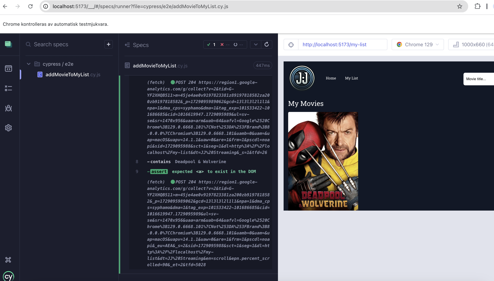

# React + Vite

# JJ Streaming

Detta projekt är en applikation för att upptäcka och söka efter populära filmer. Du som användare av sidan kan också spara filmer till din personliga lista.

## Användning
- Sök efter filmer genom att skriva i sökrutan.
- Klicka på hjärtat så läggs filmer till på "My list" uppe i headern.

## Installation
1. Klona repot.
2. Installera beroenden med `npm install`.
3. Starta servern med `npm run dev`.

### Funktioner
- Sökfunktionalitet
- Favoriter
- Responsiv design

### Teknologier
- React
- Redux
- React Router
- Material-UI (MUI)
- Axios
- Tailwind CSS
- Vite
- React Helmet
- Google Tag Manager

## Testresultat

### End-2-End Test

Nedan visar jag på att mitt test fungerade.

 